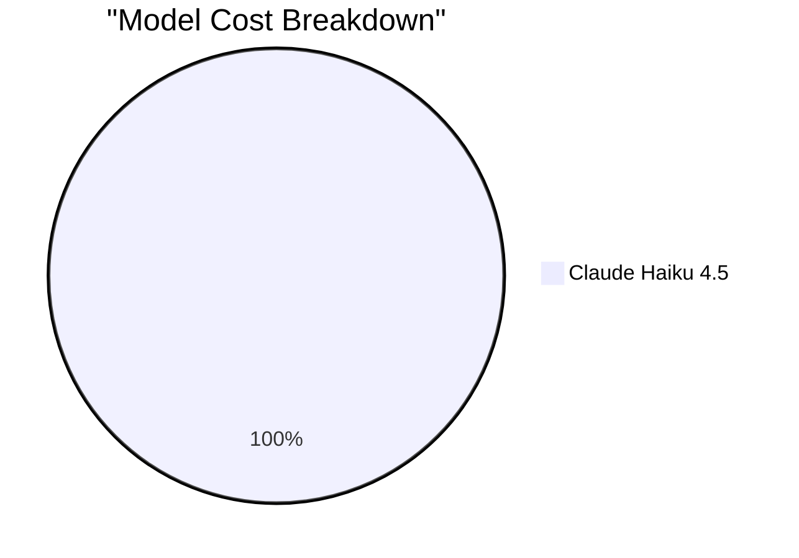

# copilot-session-usage

Extract VS Code Copilot session cost KPIs from local debug logs.
If you do not have information about which session to use, use `VSCODE_TARGET_SESSION_LOG`
to find the current session ID.

Beware of `latest` session ID when several sessions are running in parallel.

## When to use

- You need to estimate how much a Copilot chat session cost in tokens and USD
- You want to compare costs across sessions, models, or time periods
- You need to attribute costs to subagents (e.g. `runSubagent` calls)
- You want batch analysis of multiple sessions

## Installation

```bash
uv tool install copilot-session-usage
```

## CLI Usage

```bash
# Analyze a session
# Use VSCODE_TARGET_SESSION_LOG to get the current session ID,
# it is NOT necessarily the latest !
copilot-session-usage id <session-id>

# Analyze a specific session by its debug-log directory
copilot-session-usage analyze /path/to/session/debug-logs

# List recent sessions (metadata only)
copilot-session-usage list

# Batch analyze the last 10 sessions
copilot-session-usage batch 10

# Full detail JSON output
copilot-session-usage latest --detail full --format json
```

## Key Features

- **Per-model pricing** with cache-hit discounts
- **Multi-model sessions** correctly handled
- **Threshold-aware pricing** for long-context tiers
- **Subagent cost attribution**
- **Cross-platform** (macOS, Linux, Windows, WSL2)
- **Three detail levels**: minimal, compact, full
- **JSON, table and detailed output**

## Pricing Data

Pricing data is bundled withing the copilot-session-usage package in `src/copilot_session_usage/data/`:

- `models-and-pricing.yml` — Standard model pricing
- `models-and-pricing.lock` — Lock file for reproducibility
- `custom-models-pricing.yml` — Custom / organization-specific pricing

## Provider Support

| Provider | Status | Notes |
|----------|--------|-------|
| VS Code  | ✅ Supported | Auto-detects workspaceStorage |
| CLI      | 🚧 Planned | Not yet implemented |

## Output Formats

- `table` — Human-readable aligned table (default)
- `json` — Machine-readable JSON
- `detailed` — Alias for `table` with `full` detail

## Preferred Output

### Default Summary (Detailed)

Several output formats are available. If the user did not requested any specific format,
only output the summary table with detailed information ("Option 2")


### Option 1: Concise output

```
Session Cost Report (2026-07-06):
  • Total: $1.91 USD | 10.2M tokens | 95.4% cache hit
  • Duration: 82 min (47 min active) | 137 LLM calls
  • Model: Claude Haiku 4.5
  • Subagents:
    - main: 9.5M→64K tokens, $1.74 (122 calls)
    - Explore: 641K→7K tokens, $0.17 (15 calls)
```

### Option 2: Table Output (Two Tables)

**Table 1: Session Summary**

```markdown
| Metric | Value |
|--------|-------|
| Total Cost | $1.91 USD |
| Total Tokens | 10.2M input + 71K output |
| Cached Tokens | 9.7M (95.4% cache hit) |
| Duration | 82 min (47 min active) |
| LLM Calls | 137 |
| Model | Claude Haiku 4.5 |
```

**Table 2: Subagent Breakdown**

```markdown
| Subagent | Input Tokens | Output Tokens | Cached Tokens | LLM Calls | Cost |
|----------|--------------|---------------|---------------|-----------|------|
| main | 9.5M | 64K | 9.1M | 122 | $1.74 |
| Explore | 641K | 7K | 585K | 15 | $0.17 |
| **TOTAL** | **10.2M** | **71K** | **9.7M** | **137** | **$1.91** |
```

### Option 3: Mermaid Chart Output (Model Cost Breakdown)



**Note:** For multi-model sessions, break down by model only (not by subagent), to avoid double-counting costs already attributed to models.
