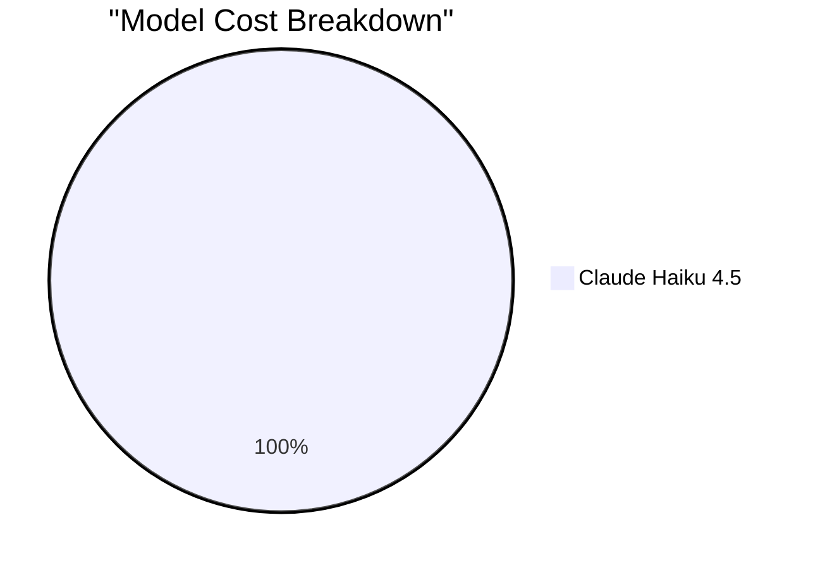

# copilot-session-usage

Extract VS Code Copilot, Copilot CLI, or Copilot App session cost KPIs from
local logs. VS Code sessions use debug logs; CLI/App sessions use structured
`events.jsonl` files under the Copilot session-state root.

If you are analyzing a VS Code session and do not have information about which
session to use, use `VSCODE_TARGET_SESSION_LOG` to find the current session ID.

`VSCODE_TARGET_SESSION_LOG` is provided by VS Code Copilot as a **context/template variable**,
not as an environment variable. Extract the session UUID from the last path component and
pass it to the CLI with `--session-id`.

Beware of `latest` session ID when several sessions are running in parallel.
The default provider is `vscode`; select Copilot CLI/App sessions explicitly
with `--agent cli`.

## When to use

- You need to estimate how much a Copilot chat session cost in tokens and USD
- You want to compare costs across sessions, models, or time periods
- You need to attribute costs to subagents (e.g. `runSubagent` calls)
- You want batch analysis of multiple sessions
- You need a compact total/per-model/per-session report for a date span

## Installation

```bash
uv tool install copilot-session-usage
```

## Token-efficient CLI usage

The CLI is designed to replace manual loops with single commands. Prefer these
patterns to minimize token spend and avoid parsing intermediate output.

### Single session

```bash
# Fastest: analyze a known debug-log directory
copilot-session-usage analyze /path/to/session/debug-logs --format table

# Or analyze by exact session ID (use VSCODE_TARGET_SESSION_LOG)
copilot-session-usage id <session-id> --format table

# Analyze the latest Copilot CLI/App session
copilot-session-usage --agent cli latest --format table

# Analyze an exported or relocated Copilot CLI/App event log
copilot-session-usage --agent cli analyze /path/to/events.jsonl --format table
```

### Aggregate across matching sessions

```bash
# One command replaces: list → filter → analyze each → sum
copilot-session-usage analyze --name "PRD: /path/to/prd" --aggregate --format table

# Add date bounds to narrow the window
copilot-session-usage analyze \
  --name "PRD: /path/to/prd" \
  --since 2026-06-30T00:00:00Z \
  --until 2026-07-07T00:00:00Z \
  --aggregate \
  --format table
```

### Date-span breakdown

For requests such as "today", "yesterday", or "last week", resolve the period
to ISO 8601 bounds in the user's local timezone and make one compact call:

```bash
copilot-session-usage --agent all span \
  --since 2026-09-11T00:00:00+02:00 \
  --until 2026-09-11T20:19:00+02:00 \
  --format json
```

Use `--last 7d` for a rolling window. The span report contains only period
metadata, cross-session totals, per-model totals, and minimal per-session rows;
it is the preferred path for token-efficient multi-session analysis. Missing
provider roots in `--agent all` mode are ignored, and unavailable evidence is
reported as `null` rather than fabricated as zero.

Use the [date-span analysis reference](references/span-analysis-template.md)
for the JSON contract and the response template. Do not call `list` and then
analyze sessions one by one for this use case.

### Directory-level listing with costs

```bash
# When you already know the debug-logs folder, skip workspace discovery
copilot-session-usage list --dir /path/to/debug-logs --format table

# Use an alternate Copilot CLI/App session root
copilot-session-usage --agent cli --session-root /path/to/session-state list
```

### Extract a single field

```bash
# Avoid parsing full JSON when you only need one value
copilot-session-usage analyze /path/to/debug-logs --query .total.estimated_usd
copilot-session-usage analyze --name "PRD" --aggregate --query .total_estimated_usd
```

### Cost-efficiency summary

```bash
# Cache ratio, model split, and cost per 1M tokens in one block
copilot-session-usage analyze /path/to/debug-logs --summary --format table
```

## CLI Usage

```bash
# Analyze a session
# Use VSCODE_TARGET_SESSION_LOG to get the current session ID,
# it is NOT necessarily the latest !
copilot-session-usage id <session-id>

# Analyze a specific session by its debug-log directory
copilot-session-usage analyze /path/to/session/debug-logs

# Analyze many sessions by regex and aggregate
copilot-session-usage analyze --name "PRD: /path/to/prd" --aggregate --format table

# List recent sessions (metadata only)
copilot-session-usage list

# List sessions in a debug-logs folder with cost columns
copilot-session-usage list --dir /path/to/debug-logs --format table

# Batch analyze the last 10 sessions
copilot-session-usage batch 10

# Compact total/model/session report for a date span
copilot-session-usage --agent all span \
  --since 2026-07-01T00:00:00Z \
  --until 2026-07-08T00:00:00Z \
  --format json

# Full detail JSON output
copilot-session-usage latest --detail full --format json

# Amend the current HEAD commit with accumulated session cost trailers.
# Extract <session-id> from VSCODE_TARGET_SESSION_LOG in the Copilot context.
copilot-session-usage amend-commit --session-id <session-id>

# Preview trailers without amending
copilot-session-usage amend-commit --session-id <session-id> --dry-run
```

### Copilot CLI/App provider

Copilot CLI and the Copilot App persist sessions below
`~/.copilot/session-state/` on macOS. Use `--agent cli` for this provider;
`--session-root PATH` overrides the discovery root:

```bash
# List recent CLI/App sessions
copilot-session-usage --agent cli list --format table

# Analyze a specific CLI/App session by UUID
copilot-session-usage --agent cli id <session-id> --format table

# Analyze all available providers explicitly
copilot-session-usage --agent all list --format table
```

The CLI/App provider uses the final `session.shutdown` event for shared token
and estimated-cost totals. Active or interrupted sessions can expose only
provider-native checkpoint counters; shared totals are then reported as
unavailable rather than zero. Per-skill cost and validated per-subagent cost
breakdowns are unavailable when the event log contains only cumulative session
totals, although detected skills, tool calls, and raw provider evidence remain
available.

## Skill-Aware Analysis

The tool automatically detects and attributes costs to **skills** (e.g., `/skill-name`, `/namespace:skill-name`)
by analyzing user messages, discovery events, and LLM call history. Use these commands
to understand how skills are impacting your session costs.

### Single-session skill analysis

```bash
# Show per-skill cost breakdown for a session
copilot-session-usage id <session-id> --skill-breakdown

# Filter to a specific skill and see only its costs
copilot-session-usage id <session-id> --skill /my-skill

# Show tool calls per skill and per subagent
copilot-session-usage id <session-id> --tool-breakdown

# Combine filters: skill + tool breakdown
copilot-session-usage id <session-id> --skill /my-skill --tool-breakdown

# Minimal JSON output (skill, cost_usd, tokens, llm_calls only)
copilot-session-usage id <session-id> --skill /my-skill --format json --minimal
```

### Aggregate skills across sessions

```bash
# List all skills used in the last 7 days with aggregated costs
copilot-session-usage skills --last 7d

# List skills for a date range with detailed breakdown
copilot-session-usage skills --since 2026-06-30 --until 2026-07-07 --format table

# Filter sessions by title pattern, then aggregate skills
copilot-session-usage skills --title "PRD" --last 30d --format table
```

### Session filtering by title

```bash
# Find sessions matching a substring (case-insensitive)
copilot-session-usage list --title "my project" --format table

# Analyze multiple sessions by title and aggregate
copilot-session-usage analyze --title "bug fix" --aggregate --format table

# Combine title filter with skill breakdown
copilot-session-usage analyze --title "feature" --aggregate --skill-breakdown --format table
```

## Key Features

- **Per-model pricing** with cache-hit discounts
- **Multi-model sessions** correctly handled
- **Threshold-aware pricing** for long-context tiers
- **Subagent cost attribution**
- **Provider-aware skill attribution** — detect skills and attribute costs/tool calls where the source evidence supports it
- **Cross-platform** (macOS, Linux, Windows, WSL2)
- **Three detail levels**: minimal, compact, full
- **JSON, table and detailed output**
- **Regex session filtering** by title or ID (`--name`)
- **Case-insensitive session title filtering** (`--title SUBSTRING`)
- **Date-range filtering** (`--since`, `--until`, ISO 8601 with timezone)
- **Relative date filtering** (`--last "7d"`, `--last "24h"`, `--last "30m"`)
- **Aggregation** across many sessions in one command (`--aggregate`)
- **Compact date-span reports** with total, per-model, and per-session sections (`span`)
- **Efficiency summaries** with cache ratio, model split, and cost per 1M tokens (`--summary`)
- **Skill-breakdown analysis** — per-skill cost breakdown with `--skill-breakdown`
- **Tool-call tracking** — per-skill/per-subagent tool invocation counts with `--tool-breakdown`
- **Single-skill filtering** — focus analysis on one skill with `--skill SKILL`
- **Skill aggregation** — list all skills and their costs across sessions with `skills` command
- **Field extraction** with dot notation (`--query`)
- **Commit amendment** with accumulated per-model cost trailers (`amend-commit`)

## Injecting cost trailers into commits

Use `amend-commit` to update the HEAD commit with accumulated session usage
as Git commit-message trailers. One line is emitted per model, plus a total
AIC (AI credits) summary line:

```
Copilot-Session-Usage-Acc: Moonshot AI:Kimi K2.7 Code,in:24.90,out:0.06,cache:21.88,aic:231
Copilot-Session-Usage-AIC: 232
```

The vendor and model name come from the actual session context (debug-log
`llm_request` events and bundled pricing data). Vendor names are rendered with
human-readable casing (for example, `Moonshot AI` instead of `moonshot_ai`), and
model names keep the casing from the pricing data (for example, `Kimi K2.7 Code`
instead of the lower-cased log identifier `kimi-k2.7-code`). Token counts are in
millions of tokens with two decimals; AIC values are USD * 100 and rounded to two decimals (1 AIC = $0.01).

When a change spans several VS Code Copilot sessions, pass each session ID
with a separate `--session-id` argument. The costs are accumulated and written
as one trailer block. Add `--with-session-id` to also burn one
`Copilot-Session-Usage-Session-ID` trailer per session ID, which makes it
possible to rewrite the commit chain with commit-accurate costs later.

### Finding the current session ID

`VSCODE_TARGET_SESSION_LOG` is provided in the Copilot agent context as a
template variable, **not** an environment variable. Extract the session UUID
from the last path component:

```bash
# VSCODE_TARGET_SESSION_LOG looks like:
# /.../workspaceStorage/<hash>/GitHub.copilot-chat/debug-logs/<session-id>
SESSION_ID=$(basename "{{VSCODE_TARGET_SESSION_LOG}}")
copilot-session-usage amend-commit --session-id "$SESSION_ID"
```

If the context does not expose the variable, fall back to `copilot-session-usage latest`
or `copilot-session-usage list` to identify the session manually.

`amend-commit` preserves any existing `Signed-off-by` trailer by placing the
new cost trailers immediately before it, not after it.

## Pricing Data

Pricing data is bundled withing the copilot-session-usage package in `src/copilot_session_usage/data/`:

- `models-and-pricing.yml` — Standard model pricing
- `models-and-pricing.lock` — Lock file for reproducibility
- `custom-models-pricing.yml` — Custom / organization-specific pricing

## Provider Support

| Provider | Status | Notes |
|----------|--------|-------|
| VS Code  | ✅ Supported | Auto-detects platform-specific `workspaceStorage` roots |
| CLI/App  | ✅ Supported | Auto-detects `~/.copilot/session-state/` and accepts explicit session paths |
| Both    | ✅ Supported | Explicit opt-in combined discovery and aggregation mode |

## Output Formats

- `table` — Human-readable aligned table (default)
- `json` — Machine-readable JSON
- `detailed` — Alias for `table` with `full` detail

## Preferred workflow for agents

When asked about session cost, use the most token-efficient command that answers
the question:

1. **Need one number?** Use `--query`.
2. **Need totals across several sessions?** Use `analyze --name ... --aggregate`.
3. **Need a per-session breakdown?** Use `analyze --name ... --summary --format table`.
4. **Need full details for one session?** Use `analyze PATH --format table` or `--format detailed`.
5. **Need to know which skills are expensive?** Use `skills --last 7d` to see aggregated costs per skill.
6. **Need skill costs for one session?** Use `id <session-id> --skill-breakdown --format table`.
7. **Need to focus on one skill?** Use `id <session-id> --skill /my-skill --format table`.
8. **Need tool-call visibility per skill?** Use `--tool-breakdown` flag to see function invocations.
9. **Need to find sessions by name?** Use `analyze --title "SUBSTRING" --aggregate` for batch analysis.
10. **Need concise JSON?** Use `--format json --minimal` to get only {skill, cost_usd, tokens, llm_calls}.

Avoid chaining `list` + multiple `analyze` calls when `--name` + `--aggregate` or
`--summary` can do it in one pass. Similarly, avoid looping over sessions for skill analysis
when `skills` command can aggregate in one call.

## Preferred Output

### Default Summary (Detailed)

Several output formats are available. If the user did not requested any specific format,
only output the summary table with detailed information ("Option 2")


### Option 1: Concise output

```
Session Cost Report (2026-07-06):
  • Total: $1.91 USD | 10.2M tokens | 95.4% cache hit
  • Duration: 82 min (47 min active) | 137 LLM calls
  • Model: Claude Haiku 4.5
  • Subagents:
    - main: 9.5M→64K tokens, $1.74 (122 calls)
    - Explore: 641K→7K tokens, $0.17 (15 calls)
```

### Option 2: Table Output (Two Tables)

**Table 1: Session Summary**

```markdown
| Metric | Value |
|--------|-------|
| Total Cost | $1.91 USD |
| Total Tokens | 10.2M input + 71K output |
| Cached Tokens | 9.7M (95.4% cache hit) |
| Duration | 82 min (47 min active) |
| LLM Calls | 137 |
| Model | Claude Haiku 4.5 |
```

**Table 2: Subagent Breakdown**

```markdown
| Subagent | Input Tokens | Output Tokens | Cached Tokens | LLM Calls | Cost |
|----------|--------------|---------------|---------------|-----------|------|
| main | 9.5M | 64K | 9.1M | 122 | $1.74 |
| Explore | 641K | 7K | 585K | 15 | $0.17 |
| **TOTAL** | **10.2M** | **71K** | **9.7M** | **137** | **$1.91** |
```

### Option 3: Mermaid Chart Output (Model Cost Breakdown)


```mermaid
pie title "Model Cost Breakdown"
    "Claude Haiku 4.5" : 1.909
```

**Note:** For multi-model sessions, break down by model only (not by subagent), to avoid double-counting costs already attributed to models.
